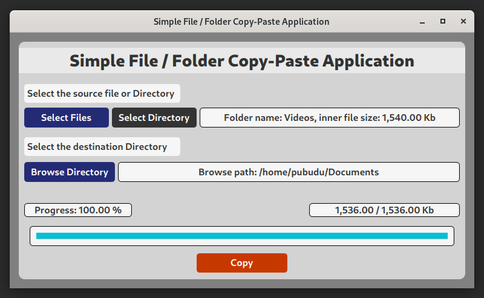

# Simple File / Folder Copy-Paste Application 

### A simple Java-FX based File / Folder Copy-Paste Application

This is a straightforward file / folder copy-paste application that can copy any type of file or folder to a specified directory.
It has a progress bar that displays the percentage and file size of the copying files.

#### The main features of the application,

- It can copy any type of file or files to a destination directory.
- It can copy an entire directory (including multiple files and directories within) to a destination directory.

This project's goal was to improve knowledge of Java-FX, Java, Recursion, and file handling in Java.

#### User Interface

## Used Technologies

- Java SE 11
- Apache Maven 3.8.6
- Added dependencies to pom.xml
    - javafx-fxml 18.0.1
    - jfoenix 9.0.1

#### Used Integrated Development Environment
- IntelliJ IDEA

## How to use ?
This project can be used by cloning the
project to your local computer or running the project jar file.

#### Clone this repository
1. Clone the project using `git clone https://github.com/PubuduJ/file-copy-application.git` terminal command.
2. Open the `pom.xml` file from **IntelliJ IDEA**, make sure to open this as a project.
3. To run this application execute `mvn javafx:run` goal or create separate maven configuration in **IntelliJ IDEA**.

#### Run JAR file
1. Copy `file-copy-application.jar` file from the project shade directory.
2. Open terminal from the file copied directory.
3. Execute `java -jar file-copy-application.jar` command from the terminal.

## Credits
This project was carried out under the guidance of the [IJSE](https://www.ijse.lk/) Direct Entry Program 9.

## Version
v1.0.0

## License
Copyright &copy; 2022 [Pubudu Janith](https://www.linkedin.com/in/pubudujanith94/). All Rights Reserved. 
This project is licensed under the [MIT license](LICENSE.txt).